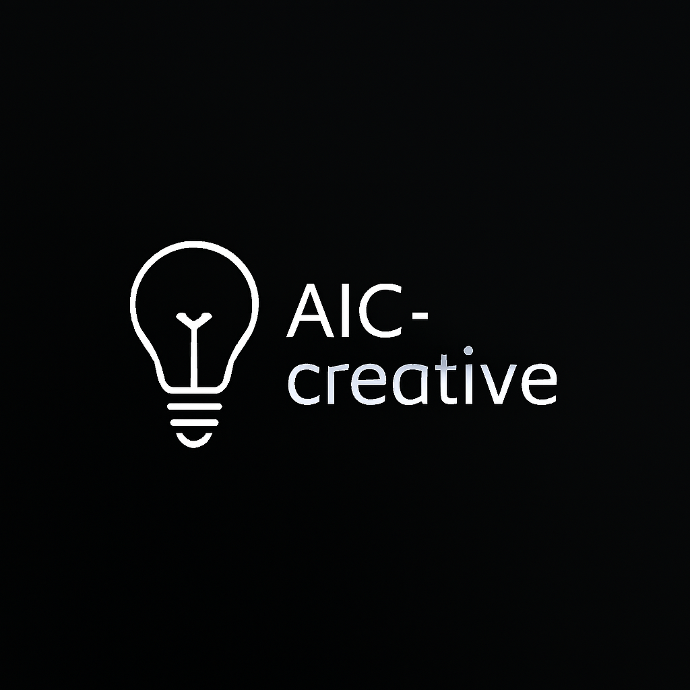

# AIC-creative
AI for art, music, ... not sellling dopamine. 

<p align="center">
  
</p>

--- 

## The Definition

AIC-Creative is a civilizational creative framework.

It is not an entertainment engine.
It is not a viral content factory.
It does not sell dopamine.

AIC-Creative explores art, music, and narrative as tools for restoring depth, coherence, and meaning in the digital age.

---

## 🌍 Vision

Modern digital platforms optimize for:

- Engagement
- Retention
- Emotional spikes
- Infinite scroll loops

AIC-Creative rejects this optimization model.

We build creative systems that prioritize:

- Reflection over reaction
- Meaning over stimulation
- Long-form coherence over short-form virality
- Silence over noise
- Civilization over trend cycles

---

## 🧠 Philosophy

AIC-Creative is built on three principles:

1. Creative systems must not exploit human neurochemistry.
2. Aesthetic production must include ethical constraints.
3. Art is a civilizational act, not a growth metric.

We treat creative generation as a high-responsibility domain.

---

## 📂 Architecture

``` pgsql 
AIC-Creative/
│
├── core/ # Creative engine, aesthetic scoring, anti-dopamine filter
├── art/ # Symbolic and generative art systems
├── music/ # Harmonic research and silence-aware composition
├── narrative/ # Long-form myth and introspective storytelling
├── slow_media/ # Contemplative UI and time-aware design
├── governance/ # Ethical policies and risk registers
│
├── CONTRIBUTING.md
├── SECURITY.md
├── CODE_OF_CONDUCT.md
├── LICENSE
└── README.md

```

---

## 🎨 Art Module

Focus areas:

- Archetypal symbolic systems
- Civilizational visual language
- Non-exploitative generative art
- Aesthetic stability research

Not included:

- Trend-driven art
- Shock imagery
- Viral visual optimization

---

## 🎼 Music Module

Focus areas:

- Harmonic structures rooted in mathematics
- Long-form ambient composition
- Silence-aware music generation
- Calm-state cognitive alignment

Not included:

- Addictive short loops
- High-density stimulation music
- Engagement-optimized beats

---

## 📖 Narrative Module

Focus areas:

- Long-form storytelling engines
- Myth reconstruction
- Philosophical dialogue systems
- Introspective human-AI narrative structures

Not included:

- Clickbait content
- Outrage amplification
- Shock storytelling

---

## 🧘 Slow Media Layer

AIC-Creative experiments with:

- Time-gated content
- Reflection prompts
- Structured pauses
- Meaning recap mechanisms

We intentionally avoid:

- Infinite scroll
- Autoplay
- Notification spam
- Random reward loops

---

## 🛡 Ethical Safeguards

All creative outputs may pass through:

- Meaning analysis
- Manipulation risk assessment
- Emotional stability scoring
- Anti-dopamine filter

Creative generation is not considered complete until ethical evaluation is performed.

---

## 🔬 Research Direction

Long-term research areas:

- Civilizational aesthetics modeling
- Meaning graph construction
- Harmonic cognition mapping
- Symbolic systems and archetype encoding
- Post-dopamine digital design theory

---

## ⚙️ Integration with AIC Ecosystem

AIC-Creative connects with:

- AIC-Research (theoretical foundation)
- AIC-Governance (ethical oversight)
- AIC-Agents (behavioral interaction)
- AdaptiveOS (system-level integration)
- Human Meaning Network (cultural dimension)

Creative output is treated as infrastructure, not entertainment.

---

## 🤝 Contributing

Please read:

- CONTRIBUTING.md
- SECURITY.md
- CODE_OF_CONDUCT.md

All contributions require both technical and ethical justification.

---

## 🔐 Security & Responsibility

Security includes:

- Technical vulnerabilities
- Model exploitation
- Psychological manipulation vectors

AIC-Creative protects both systems and human cognition.

---

## 📜 License

Licensed under the GNU-GPL 3.0 unless otherwise specified.

---

## 🧭 Final Note

The internet optimized for attention.
AIC-Creative optimizes for civilization.

If you are here to maximize metrics, this is not your project.
If you are here to rebuild meaning, welcome.

